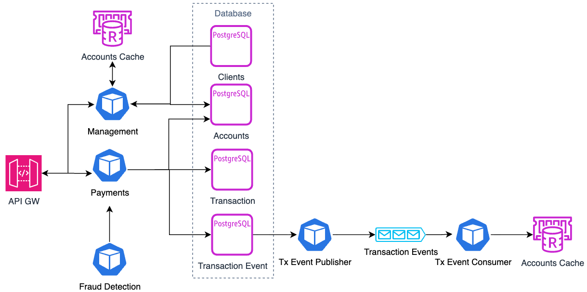
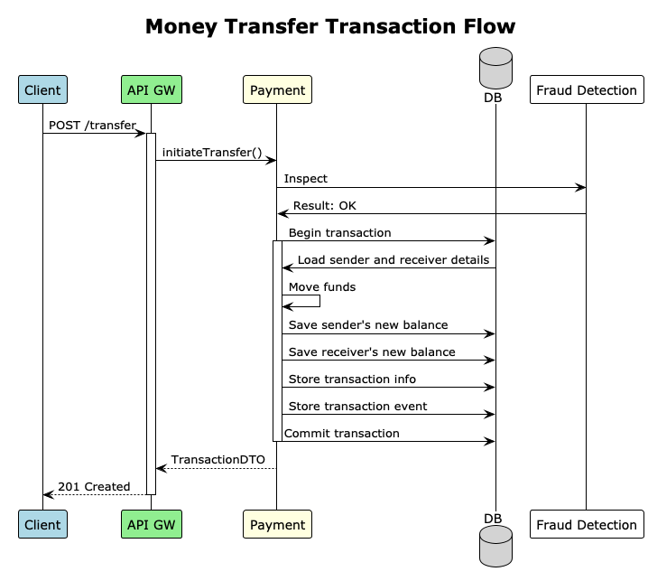
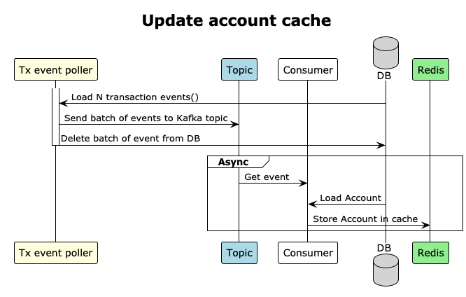
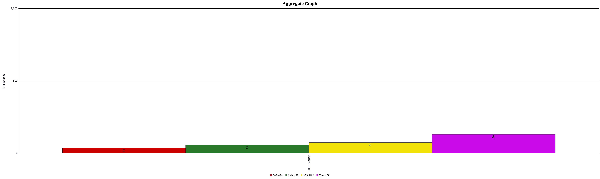
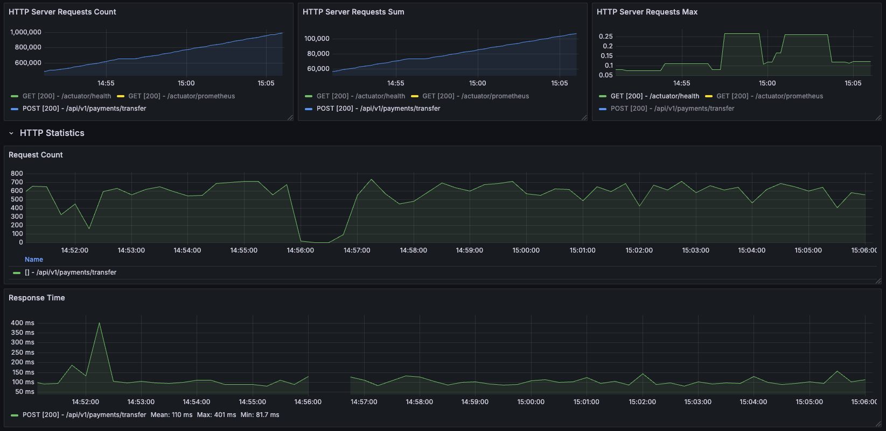

# Case Study: High-Performance Financial Transaction System

## Problem Statement
Need to design and build POC of a high-performance, scalable money transfer system that allows clients to view their account lists and transfer funds to other clients.

The system must handle high concurrency, ensure data consistency, and integrate with multiple external services (e.g., fraud detection, notification services, ledger updates).

### Key Requirements
* Account Management
  * Fetch and display a list of accounts for a given client.
  * Account data must be **cached** for performance.
* Money Transfer
  * Support **high-frequency transactions** with low latency.
  * Ensure **atomicity** (transactions succeed or fail completely).
  * Handle **retries** in case of temporary failures (network issues, external service unavailability).
* External Service Integration
  * Fraud detection service (sync call, must be fast).
  * Notification service (async, eventual consistency).
  * Ledger service (must be eventually consistent).
* Performance & Scalability
  * Optimize for **high throughput** (thousands of transactions per second).
  * Use **Kafka for async processing** where possible.
  * Implement **caching (Redis)** to reduce database load.
* Resilience
  * **Retry policies** for transient failures (exponential backoff).
  * **Circuit breakers** to avoid cascading failures.
  * **Idempotency** to prevent duplicate transactions.

## Evaluation Criteria
* **Correctness** – No double-spending, data consistency.
* **Performance** – Handles 1,000+ TPS with low latency.
* **Resilience** – Retries, circuit breakers, idempotency.
* **Scalability** – Microservices, Kafka, caching.
* **Code Quality** – Clean architecture, tests, observability.

# Solution
## Main decisions
To achieve high scalability, the system is designed using the microservices approach.
Core components such as money transfer and account management are implemented using a reactive approach.
The reactive approach allows reducing latency and increasing throughput because of non-blocking I/O with the database and external cache(Redis).
Also, Project Reactor provides a set of operators that can be used to implement retries and backoff and simplify the implementation.

## Design
### Domain driven design
All the components designed and implemented in DDD paradigm (at least it tries to be).
Such an approach allows separating domain logic from implementation details and infrastructure-related dependencies.

Application structure:
* Application - Application integration logic. Binding REST API with domain logic.
* Domain - Core domain model
* Infrastructure - Domain logic implementation using concrete technologies.
    * Persistence - Sublevel of infrastructure. Dedicated to persistence layer.

### Components
* API GW - API facade for all endpoints
* Payments - Perform money transfer operation between accounts. Generate transaction events.
* Management - Client and Account management. Provides account info(current balance)
* Fraud Detection - Check if a transaction is fraudulent or not
* Tx Event Publisher - Polls money transaction events and publish them into the Kafka topic
* payment-models - Common 
* Database Migration - Auxiliary module to manage database schema changes using Flyway and more

### Architecture diagram

### Interservice communication
For the sake of simplicity and amount of data in the synchronous communication between services used JSON over REST.
gRPC can be used here, but it just adds more complexity rather than performance improvement.
Asynchronous operations are done using Kafka.

### 

### Dataflows
**Payment transaction**
Payment operation implented as syncrhonous REST call to measure response time.

**Update account balance cache**

## Implementation details
### Stack
* Java 25
* Spring Boot and Spring Cloud ecosystem
* Infrastructure
  * PostgreSQL(Reactive driver)
  * Kafka
  * Redis

### Service Discovery
Service discovery is implemented using Spring Cloud Eureka server.

### API Gateway
API Gateway is implemented using Spring Cloud Gateway. It provides a single entry point for all API calls.
In cooperation with the Eureka server, it provides load balancing capabilities.

### Payment
Payment service is a core component and implemented using Spring WebFlux.
It uses a reactive programming approach to manage resources(non-blocking IO) effectively and as result reducing latency and increase throughput.

#### Key moments
* Domain layer contains only interfaces
* It was difficult to separate pure domain logic of transactional money transfer from the reactive implementation.
* Also domain repository implementations use Spring Data Reactive repository delegates.

#### Money transfer logic implementation
**Problems:**
* Update two accounts in one transaction
* High concurrency on update rows
* Need "Send notification" for each money transfer operation

**Possible solutions:**
* Use pessimistic lock
* Use optimistic lock

**Solution:**
Pessimistic lock aka "select for update" is not a right solution for this case, because it locks a row for the whole transaction.
As a result, at least it hits performance. Another thing is in our case of high concurrency on updating one row, it might cause a lot of contention and deadlocks.
So, a reactive driver and optimistic locks based on a row version with retries is the solution.

Each money transfer operation should have a result row in the transaction table with request parameters, status and reason in case of failures.

**Notification**
To notify clients about money transfer operation Transactional Outbox pattern to atomically save money transfer opration and send notification.
The idea is to create a transactional outbox table and save money transfer operation in it.
Then, a separate service(Tx Event Publisher) will poll this table and send notifications to clients through Kafka topic.
More details about this solution will be described in the corresponding section.

**The Algorithm:**
1. Send request to Fraud Detection service
2. Return failed transaction in case of failed inspection. Exit.
3. Transaction started
4. Load sender and receiver accounts from DB
5. Check if sender has enough money for operation
6. Fail if not enough money
7. Update sender account balance
8. Update receiver account balance
9. Update sender account in DB
    1. Retry from step 3 if operation failed
10. Update receiver account in DB
    1. Retry from step 3 if operation failed
11. Create transaction record
    1. Retry from step 3 if operation failed
12. Create transaction event record
    1. Retry from step 3 if operation failed
13. Commit transaction
14. Return transaction

Retry logic with backoff strategy implemented using Project Reactor operators.

**Communication with Fraud Detection Service**
Payments service communicates with fraud detection service using Spring WebClient that provides load balacing(with Eureka) and retry capabilities out of the box.

**Testing approach**
Since real logic implemented in infrastructure layer there is no need to test repositories independently.
Instead of this we have integration tests which covers whole money transfer service.
Integration test simulates and verify results of 500 concurrent requests to the service that randomly transfers money between 100 accounts.

### Deduplication
Deduplication mechanism implemented using Redis for keeping idempotency key and response.

#### The algorithm
1. Try to set the idempotency key in Redis
2. If success then it means a new request. Proceed execution, cache response and return it.
3. If the key is exists then it means two things:
   1. Request is already processed. Return response from Redis.
   2. Request is in progress. Wait for the response and return it once the response is available.

#### Implementation
Idempotency key is required in the payload of the request.
All logic related to idempotency is implemented in the Payments service in the IdempotencyService.

#### Testing
Unit test with Mockito mock framework has been created.
Mockito is used to mock interaction with Redis and verify required Redis operations invocation according to the described algorithm.

### Fraud Detection(FD)
FD exposes synchronous(according to requirements) REST API.
#### Implementation details
FraudDetector has a list of inspection rules that executed against each transaction(Chain of Responsibility design attern).
Each rule is defined in a separate class that implements the InspectRule interface.
The interface has a single method that accepts a transaction and returns a boolean value whether the transaction is fraudulent or not.
FD approves transaction approved only if all rules return true.

**Inspection rules:**
* Amount is more than N dollars - implemented
* Number of small transactions per [defined period] - Not implemented. Can be implemented with Sliding windows algorithm using Redis.

### Transaction(Tx) event publisher
Tx Event Publisher is a separate service that polls money transfer events from DB and publishes them into the Kafka topic.

**Problem**
* How to read from the transaction events table and keep the order of events?
* How to avoid read the same event multiple times?
* Transaction event order

**Solution**
To avoid reading the same event multiple times, we need to read(select for update avoid locked rows) and delete them after publish to Kafka in a single transaction
Kafka guarantees order only withing a single partition. So if we use one publisher and single partition we can guarantee the order of events.

The alternative solution for polling events is to use Debezium CDC Postgres to Kafka connector which reads WAL and pushes events to Kafka topic.
However this approach is not used in this solution to save time.

### Management
Management service provides synchronous REST API for
* Creating Clients and Accounts.
* View list of accounts for a given client.

Also account cache refresher(worker) subscribed on transaction events topic and updates account in the Redis cache.

**Caching strategy**

To avoid perofrmance implications of AOP(using @Cacheable annotation) we will manage cache put manually.
In our case account cache will be updated only when transaction event is published or loaded from the DB if cache-miss occurs.

**Key prefix pattern**

Data partitioning should be per client and account so the key prefix pattern is: **client:[client_id]:acc:[account_id]**.
This pattern allows easy read all keys of cached accounts for a given client and then read the data avoid reading them from the DB

### Rate limiting
Rate limiting strategy based on business rules. Assuming payment transfer service is a part of the bigger multi-tenant system.
In that case, it is possible to have a lot of clients and accounts.
The default behaviour should limit by "client api key" to prevent "noisy neighbour" problem.
Rate limit implemented in API Gateway with bucket token algorithm backed by Redis.

## Tests
### Approach
Measure one instance per service to get basline performance. Assuming linear performance increases with the higher number of instances and proper configuration of infrastructure components.

### Env
* Macbook pro M1
* 16GB RAM

### Tools
* JMeter for generating load
* Grafana and Jmeter capabilities for monitoring

### Test run 1
#### Test scenario
* 20 threads
* 20 minutes duration
* 649747 total transactions
* No retry due to optimistic lock

#### Results
| Metric                | Value  |
|-----------------------|--------|
| Total Transactions    | 649747 |
| Avg Transactions/sec  | 541.72 |
| 90th percentile       | 56ms   |
| 95th percentile       | 73ms   |
| 99th percentile       | 130ms  |
| Error Rate            | 0%     |

### Test run 2
#### Test scenario
* 80 threads
* 40 minutes duration, 2 serial runs
* 755318 total transactions
* No retry due to optimistic lock
#### Results
| Metric                | Value  |
|-----------------------|--------|
| Total Transactions    | 755318 |
| Avg Transactions/sec  | 630    |
| 90th percentile       | 195ms  |
| 95th percentile       | 248ms  |
| 99th percentile       | 438ms  |
| Error Rate            | 0%     |

### Conclusion
At the beginning of the 2 test run there was a huge lag and the response time was very high up to 2 seconds. So it affects total numbers, but on the graphs we can see that avg latency is below 120-140ms.

Reactive approach shows pretty good performance. The solution is able to handle even more 1K TPS with proper scaling and hardware.

### Bonus Challenges (Optional)
* How would you handle a partial failure where money is debited but not credited?
  * In provided solution it is not possible by design. Debit and Credit happen in one transaction with optimistic lock mechanism. Transaction properly executed or entirely failed. No partial updates. 
* How would you scale this globally (multi-region deployments)?
  * Depends on multi-tenancy.
  * Let's assume we can segment customers per region.
  * Then we deploy the solution in each region(no need cross-region DB replication)
  * Configure global Load Balancer to route request to appropriate region or segment clients by regions
* How would you introduce rate limiting to prevent abuse?
  * Implemented Token bucket mechanism backed by redis in API GW. The logic counts requests per client api key to void "noisy neighbour" problem